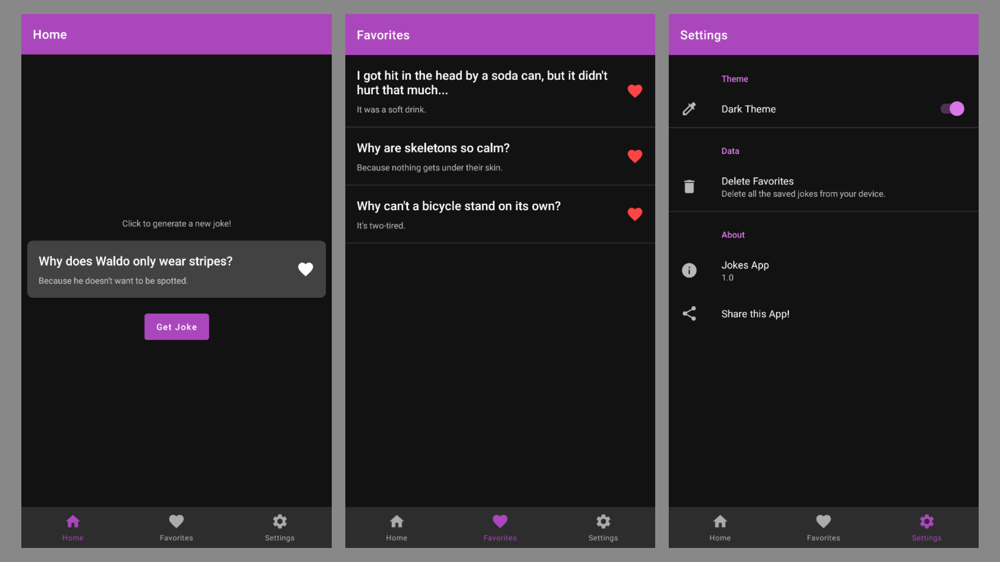

# 
 Jokes

    
    
    
    
     
    Simple app to display random jokes and save them offline.

## Screenshots

## Uses
* Kotlin
* MVVM Architecture
* Room
* Retrofit
* Gson
* ViewBinding
* Coroutines
* Hilt beta
* Jetpack navigation
* [razir/ProgressButton](https://github.com/razir/ProgressButton)
* [15Dkatz/official_joke_api](https://github.com/15Dkatz/official_joke_api)
* MDC Library
* KTX Extensions
* Coil
* ConstraintLayout
* LeakCanary

## Releases

Check [here](https://github.com/Sharkaboi/Jokes/releases) for releases.